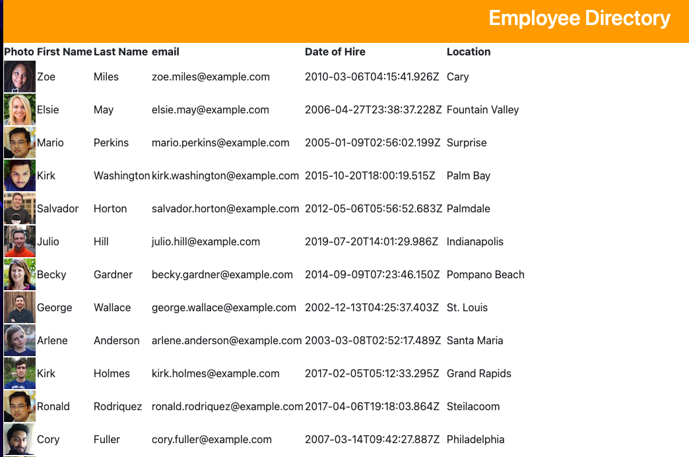

# Getting Started with Create React App

# EMPLOYEE DIRECTORY
### A simple app used to keep track of an employee data base allowing quick view of the team and some employment information 

## Technoligies Used 
- React 
- Random User API
- Bootstrap
- JSX

## Installation 
- npm install
- npm create-react-app
- npm start
- npm install --save bootstrap  

## Deployed Application
adams1971.github.io/19-employee-directory/ 

## Screenshot 

This project was bootstrapped with [Create React App](https://github.com/facebook/create-react-app).

## Questions
Visit my GitHub: https://github.com/adams1971

Mail to: [adamscdcm@gmail.com](mailto:adamscdc@gmail.com)

